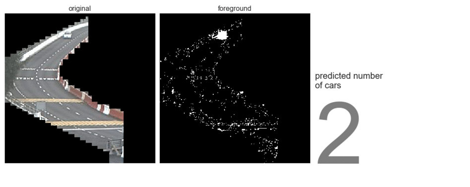

### Capstone Project: Traffic Volume Analysis
---

Estimation of traffic conditions is important in allowing commuters to decide on the best time and route of travel. This is an especially pertinent problem at the two causeways (Woodlands and Tuas) that bridge the strait between Singapore and Malaysia. On an average day, [350,000 travellers cross the Woodlands causeway alone](https://www.straitstimes.com/singapore/a-look-at-woodlands-checkpoint-singapores-first-and-last-line-of-defence), making it [one of the busiest overland border crossings in the region](https://infographics.channelnewsasia.com/interactive/causewayjam/index.html). For Singaporeans, crossing into Malaysia can take anywhere from 30 minutes at optimal conditions and several hours during popular crossing times such as Saturday mornings. Having an understanding of existing traffic conditions at the checkpoints would allow Singaporean commuters to make better decisions about whether or not to make the journey across at a given time. 

Currently, commuters rely on a list of websites that display static images from the [same traffic cameras API](https://data.gov.sg/dataset/traffic-images) offered by LTA (e.g. [[1]](https://www.onemotoring.com.sg/content/onemotoring/home/driving/traffic_information/traffic-cameras/kje.html#trafficCameras), [[2]](http://www.jalanow.com/johor-singapore-live-traffic-cam.htm), [[3]](https://www.sgmytaxi.com/traffic-camera/), [[4]](http://www.checkpoint.sg/)), thus requiring them to guess how many cars were present before they visited the page and how long the current condition is expected to last. The smart phone app "Beat the Jam" went one step further and provides historic and predicted data on the time required to cross. However, as [they obtain this information from Google Maps](https://causewayjam.wordpress.com/2016/03/02/beat-the-jam-version-2-0-is-live/), it depends on crowd-sourced data and won't be as accurate as car counts obtained from real-time images.

The goal of this project is to use deep learning and image processing techniques to extract real-time traffic volume from traffic camera images. This has the potential to complement existing solutions on the market to allow better representations of traffic situations. Due to time limitations, the scope of this project is currently limited to daytime traffic at the Tuas Checkpoint. 

#### Folder Organisation:
---
    |__ code
    |   |__ 1_eda_and_preprocessing.ipynb   
    |   |__ 2_modelling_and_insights.ipynb
    |   |__ 3_appendix.ipynb     
    |__ data
    |   |__ xtrain.zip
    |   |__ xval.zip
    |   |__ xtest.zip    
    |   |__ ytrain.zip
    |   |__ yval.zip
    |   |__ ytest.zip
    |__ graphics
    |   |__ background_sub_pred.gif
    |   |__ deployment.png
    |   |__ labeller_example.png
    |   |__ traffic_cameras_map.png
    |   |__ modelling_roadmap.png
    |__ image_scraper
    |   |__ checkpoint_cameras.py
    |   |__ README.md
    |__ model
    |   |__ xgb.model
    |__ sample_images
    |__ final_presentation.pptx
    |__ README.md

#### Summary of Findings & Recommendations
---

    

The low resolution of the images hindered the training of an object detection model. As such, in this project I used a background subtraction algorithm (as shown in the figure above) followed by several machine learning and deep learning approaches to predict the number of cars in each image.

The final production (XGBoost) model extracts the number of cars from traffic images with relatively high accuracy (test MAE = 6.59), thus providing a direct estimation of road congestion in contrast to the proxy-based model used by Google Maps, which bases their traffic information on a combination of real-time data sent by smartphones and historic travel times. However, what this model lacks is the ability to estimate travel times. The two approaches should therefore be considered complementary, and could be combined for a more well-rounded application that provides better recommendations to commuters.

The biggest limitation with the current approach to modelling traffic is that it produces a model that cannot be generalised to images from other cameras. Due to the low image qualities that hinders the training of an object detection model, the current model relies on a somewhat primitive approach of manual car labelling. As each traffic camera is angled differently with regards to the cars on the road, they each produce images with different patterns of occlusion. Therefore, a model trained on labelled images from one camera would not be able to accurately predict the number of cars in images from a camera at a different angle or location.

Model deployment is covered in a different repository: https://github.com/zzeniale/traffic-app. Future expansions to include the Woodlands Checkpoint, nighttime traffic, as well as forecasting are possible.